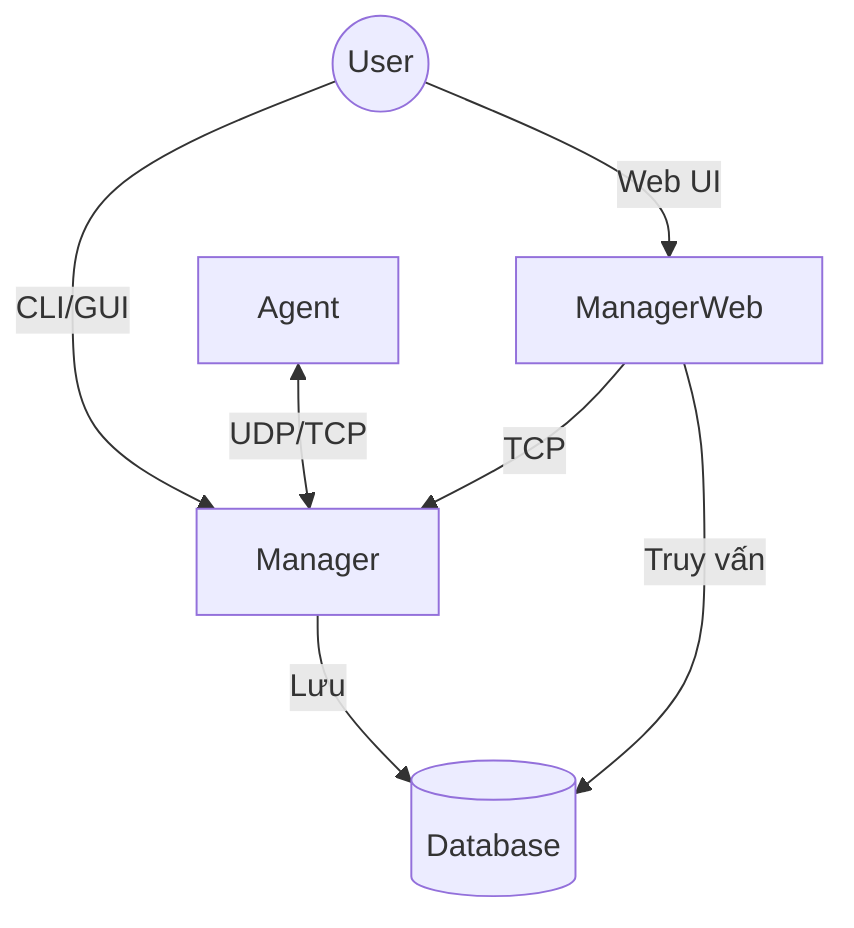
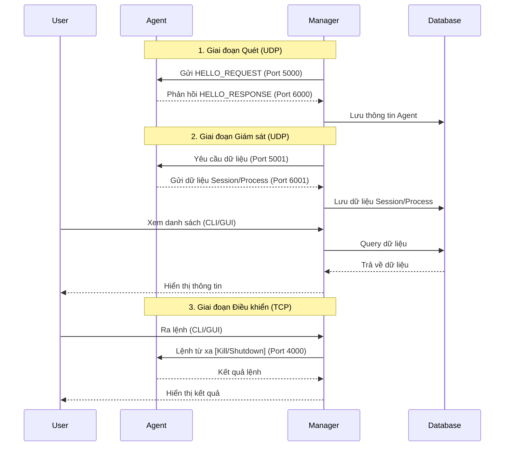
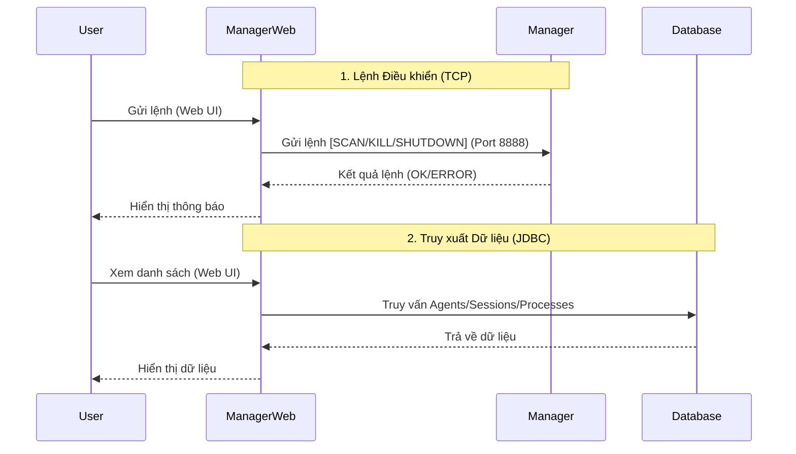

# PBL4-refactor — Hướng dẫn toàn diện

Tài liệu này tóm tắt cách phát triển (development) và cách chạy hệ thống (Agent, Manager, ManagerWeb) cho repository PBL4-refactor.

Nội dung chính được viết bằng tiếng Việt để dễ theo dõi trong quá trình phát triển và vận hành.

## Mục lục
- [Tổng quan](#tổng-quan)
- [Yêu cầu tiên quyết](#yêu-cầu-tiên-quyết)
- [Cấu trúc repository](#cấu-trúc-repository-tóm-tắt)
- [Hướng dẫn phát triển (build & run)](#hướng-dẫn-phát-triển-build--run)
- [Ghi chú vận hành & xử lý sự cố (Troubleshooting)](#xử-lý-sự-cố-troubleshooting)
- [Góp phần & phát triển mở rộng](#góp-phần--phát-triển-mở-rộng)

---

## Tổng quan

Kiến trúc chính của dự án gồm ba thành phần:

- **Agent**: thu thập dữ liệu hệ thống (CPU, RAM, process) và báo cáo về Manager.
- **Manager**: thu thập, lưu trữ (SQLite) và cung cấp giao diện CLI/GUI để quản lý.
- **ManagerWeb**: giao diện Web (JSP/Servlets) hiển thị dashboard và truy vấn dữ liệu từ Manager.

Mục tiêu README này là tập hợp các hướng dẫn thực tế để bạn có thể phát triển và chạy hệ thống.

## Yêu cầu tiên quyết

- Java JDK 8+
- Maven 3.6+
- Git

## Cấu trúc repository (tóm tắt)

```
PBL4-refactor/
├── Agent/
│   ├── pom.xml
│   └── src/main/java/
│       ├── AgentMain.java
│       ├── config/
│       │   └── AppConfig.java
│       ├── model/
│       │   ├── Computer.java
│       │   ├── Process.java
│       │   └── Session.java
│       ├── service/
│       │   ├── CommandNotificationListener.java
│       │   ├── ComputerRetriever.java
│       │   ├── ComputerSendingMonitor.java
│       │   ├── RemoteCommandServer.java
│       │   ├── SessionRetriever.java
│       │   └── SessionSendingMonitor.java
│       ├── ui/
│       │   └── AgentWindow.java
│       └── util/
│           ├── Logger.java
│           └── ProtocolManager.java
├── Manager/
│   ├── pom.xml
│   └── src/main/java/
│       ├── ManagerMain.java
│       ├── cli/
│       │   ├── CliCompleter.java
│       │   ├── CliContext.java
│       │   ├── CliHighlighter.java
│       │   ├── CliInterface.java
│       │   ├── CommandExecutor.java
│       │   ├── CommandMode.java
│       │   ├── MessageFormatter.java
│       │   └── TableFormatter.java
│       ├── config/
│       │   ├── AppConfig.java
│       │   └── ConfigManager.java
│       ├── database/
│       │   ├── AuthRepository.java
│       │   ├── ComputerManager.java
│       │   ├── DatabaseManager.java
│       │   ├── EmailManager.java
│       │   ├── ProcessManager.java
│       │   └── SessionManager.java
│       ├── model/
│       │   ├── Computer.java
│       │   ├── Process.java
│       │   ├── Session.java
│       │   └── User.java
│       ├── service/
│       │   ├── AgentDiscoveryListener.java
│       │   ├── AuthService.java
│       │   ├── ExternalScanServer.java
│       │   ├── HostScanner.java
│       │   ├── NetworkMessageService.java
│       │   ├── RemoteCommandClient.java
│       │   ├── ResourceMonitor.java
│       │   └── SessionRetriever.java
│       ├── ui/
│       │   ├── AgentWindow.java
│       │   ├── ChartPanel.java
│       │   ├── LoginDialog.java
│       │   ├── PieChart.java
│       │   ├── ProcessesList.java
│       │   └── SettingsDialog.java
│       └── util/
│           ├── CliStateManager.java
│           ├── Logger.java
│           ├── Messages.java
│           └── ProtocolManager.java
├── ManagerWeb/
│   ├── pom.xml
│   └── src/main/
│       ├── java/
│       │   ├── config/
│       │   │   ├── AppConfig.java
│       │   │   └── ConfigManager.java
│       │   ├── controller/
│       │   │   ├── AdminServlet.java
│       │   │   ├── ApiServlet.java
│       │   │   ├── AuthServlet.java
│       │   │   ├── ConfigReloadServlet.java
│       │   │   ├── DashboardServlet.java
│       │   │   ├── LogoutServlet.java
│       │   │   └── ScanServlet.java
│       │   ├── database/
│       │   │   ├── AuthRepository.java
│       │   │   ├── DatabaseManager.java
│       │   │   └── ManagerRepository.java
│       │   ├── filter/
│       │   │   └── AuthFilter.java
│       │   ├── model/
│       │   │   ├── Agent.java
│       │   │   ├── Process.java
│       │   │   ├── Session.java
│       │   │   └── User.java
│       │   ├── service/
│       │   │   ├── AuthService.java
│       │   │   ├── ConfigReloadService.java
│       │   │   └── ExternalScanClient.java
│       │   └── util/
│       │       └── Logger.java
│       └── webapp/
│           ├── WEB-INF/
│           │   └── web.xml
│           ├── assets/
│           │   ├── css/
│           │   └── js/
│           └── views/
│               ├── dashboard.jsp
│               ├── login.jsp
│               └── ...
└── README.md
```

## Cài đặt Môi trường

Để chạy dự án này, bạn cần cài đặt **Java Development Kit (JDK) 17** trở lên và **Maven**.

### 1. Windows
- **Java (JDK 17):**
  - Tải bộ cài đặt từ [Oracle](https://www.oracle.com/java/technologies/downloads/) hoặc [Adoptium](https://adoptium.net/).
  - Chạy file `.exe` và làm theo hướng dẫn.
  - Thêm biến môi trường `JAVA_HOME` trỏ đến thư mục cài đặt JDK.
- **Maven:**
  - Tải file zip từ [Maven Download](https://maven.apache.org/download.cgi).
  - Giải nén vào thư mục (ví dụ: `C:\Program Files\Maven`).
  - Thêm thư mục `bin` của Maven vào biến môi trường `PATH`.
- **Cách nhanh (dùng Chocolatey):**
  ```powershell
  choco install openjdk17 maven
  ```

### 2. macOS
- **Sử dụng Homebrew (Khuyên dùng):**
  ```bash
  # Cài đặt OpenJDK 17
  brew install openjdk@17
  
  # Link JDK để hệ thống nhận diện
  sudo ln -sfn /usr/local/opt/openjdk@17/libexec/openjdk.jdk /Library/Java/JavaVirtualMachines/openjdk-17.jdk
  
  # Cài đặt Maven
  brew install maven
  ```

### 3. Linux (Ubuntu/Debian)
```bash
# Cập nhật package list
sudo apt update

# Cài đặt OpenJDK 17
sudo apt install openjdk-17-jdk -y

# Cài đặt Maven
sudo apt install maven -y
```

### 4. Kiểm tra cài đặt
Mở terminal (hoặc CMD/PowerShell) và chạy lệnh sau để kiểm tra:
```bash
java -version
# Output mong đợi: java version "17.x.x" ...

mvn -version
# Output mong đợi: Apache Maven 3.x.x ...
```

## Hướng dẫn phát triển (build + run)

Phần này hướng dẫn làm việc nhanh với từng module.

### 1) Build & Run Agent (Java)

**Build:**
```bash
cd Agent
mvn clean package
# kết quả: target/Agent.jar
```

**Run:**
```bash
cd Agent
java -jar target/Agent.jar
# hoặc GUI: java -jar target/Agent.jar --gui
```

### 2) Build & Run Manager (Java)

**Build:**
```bash
cd Manager
mvn clean package
# kết quả: target/Manager.jar
```

**Run:**

- **GUI Mode:**
  ```bash
  cd Manager
  java -jar target/Manager.jar --gui
  ```

- **CLI Mode:**
  ```bash
  cd Manager
  java -jar target/Manager.jar
  # dùng các lệnh tương tác: scan, list agents, help
  ```

### 3) Build & Run ManagerWeb (webapp)

**Build:**
```bash
cd ManagerWeb
mvn clean package
# kết quả: target/ManagerWeb.war
```

**Run (Development with Jetty):**

> [!IMPORTANT]
> ⚠️ **Lưu ý quan trọng:** Bạn **PHẢI** chạy **Manager** trước khi khởi động **ManagerWeb**. ManagerWeb cần kết nối đến Manager (qua cổng 8888) để hoạt động đúng.

```bash
cd ManagerWeb
mvn jetty:run
# truy cập: http://localhost:8080/ManagerWeb
```

## Network Architecture

### 0. Tổng quan Hệ thống



### 1. Giao tiếp Agent ↔ Manager



### 2. Giao tiếp Manager ↔ ManagerWeb



## Ports Used

| Component | Port | Protocol | Purpose |
|-----------|------|----------|---------|
| **Agent** | 5000 | UDP | Listen for Discovery (HELLO) & Info Requests |
| **Agent** | 5001 | UDP | Listen for Session Data Requests |
| **Agent** | 4000 | TCP | Listen for Remote Commands (Kill, Shutdown) |
| **Manager** | 6000 | UDP | Receive Discovery Responses |
| **Manager** | 6001 | UDP | Receive Session Data |
| **Manager** | 8888 | TCP | External Scan Server (for ManagerWeb) |
| **Manager** | 17000| TCP | (Reserved / Unused) |
| **ManagerWeb** | 8080 | HTTP | Web interface (Jetty default) |

### Firewall Configuration

For proper operation, ensure these ports are open:
```bash
# On machines running Agent
sudo ufw allow 5000/udp
sudo ufw allow 5001/udp
sudo ufw allow 4000/tcp

# On machine running Manager
sudo ufw allow 6000/udp
sudo ufw allow 6001/udp
sudo ufw allow 8888/tcp
sudo ufw allow 8080/tcp  # If running ManagerWeb
```

## 🌍 Internationalization (i18n)

Supported languages:
- **English** (default)
- **Vietnamese**

**Change language:**
1. Manager GUI: File → Settings → Select language → Save
2. ManagerWeb: Settings → Select language → Save
3. Both applications share the same language preference via `config.json`

## 📊 Manager CLI Guide

The Manager application provides a powerful Command Line Interface (CLI) for monitoring and managing agents. It supports two modes of operation: **Interactive Mode** and **Command Mode**.

### 1. Interactive Mode

Interactive mode provides a rich shell-like experience with auto-completion, command history, and syntax highlighting.

**Start Interactive Mode:**
```bash
java -jar Manager.jar
```

**Start with Verbose Logging:**
```bash
java -jar Manager.jar --verbose
# or
java -jar Manager.jar -v
```

#### Features
- **Auto-completion:** Press `TAB` to complete commands, MAC addresses, and IDs.
- **Command History:** Use `Up`/`Down` arrows to navigate previous commands. History is saved to `~/.manager_cli_history`.
- **Context Awareness:** Set a target Agent or Session to avoid repeating IDs in subsequent commands.
- **Syntax Highlighting:** Commands and parameters are colored for better readability.

### 2. Command Mode

Command mode allows you to execute a single command and exit immediately. This is useful for scripting or quick checks.

**Syntax:**
```bash
java -jar Manager.jar -c "<command>"
# or
java -jar Manager.jar --command "<command>"
```

**Examples:**
```bash
# Trigger a network scan
java -jar Manager.jar -c "scan"

# List all discovered agents
java -jar Manager.jar -c "list agents"

# Show system status
java -jar Manager.jar -c "status"
```

> [!NOTE]
> The `scan` command in Command Mode requires an instance of Manager (Interactive or GUI) to be already running. Other commands (like `list`) query the database directly and work standalone.

### 3. Command Reference

#### Core Commands

| Command | Description |
|---------|-------------|
| `help` | Show available commands and usage info. |
| `scan` | Trigger a network scan to discover agents. |
| `status` | Show system status (agent count, session count, current context). |
| `clear` | Clear the current context (Agent/Session selection). |
| `exit` | Exit the CLI. |

#### Listing Data

| Command | Description |
|---------|-------------|
| `list agents` | Show all discovered agents with their IDs, MACs, IPs, and hardware info. |
| `list sessions` | Show sessions. Supports pagination and filtering. |
| `list processes` | Show processes. Requires a selected Session or Agent context. |
| `list current` | Show the *current* running processes for the selected Agent (snapshot). |

#### Context Management

| Command | Description |
|---------|-------------|
| `use agent <ID\|MAC>` | Select an Agent. Subsequent commands will apply to this Agent. |
| `use session <ID>` | Select a Session. Subsequent commands will apply to this Session. |

#### Advanced Listing (Head/Tail)

| Command | Description |
|---------|-------------|
| `head <N> agents` | Show the first N agents. |
| `tail <N> agents` | Show the last N agents. |
| `head <N> sessions` | Show the N most recent sessions. |
| `tail <N> sessions` | Show the N oldest sessions. |
| `head <N> processes` | Show top N processes by resource usage (CPU + RAM). |
| `tail <N> processes` | Show bottom N processes by resource usage. |

### 4. Usage Examples

#### Scenario 1: Discover and Monitor an Agent

1. **Scan for agents:**
   ```bash
   manager> scan
   ```

2. **List found agents:**
   ```bash
   manager> list agents
   ID  MAC Address        IP Address       Hostname    OS
   1   00:11:22:33:44:55  192.168.1.10     DESKTOP-1   Windows 10
   ```

3. **Select the agent:**
   ```bash
   manager> use agent 1
   # or
   manager> use agent 00:11:22:33:44:55
   ```

4. **View its sessions:**
   ```bash
   agent[00:11:22...]> list sessions
   ```

5. **View current processes:**
   ```bash
   agent[00:11:22...]> list current
   ```

#### Scenario 2: Analyze High Resource Usage

1. **Find top resource-consuming processes for a specific session:**
   ```bash
   manager> list processes for session 123
   ```

2. **Or, using context:**
   ```bash
   manager> use session 123
   session[123]> head 10 processes
   ```

#### Scenario 3: Pagination

1. **View sessions 100-200:**
   ```bash
   manager> list sessions offset 100 limit 100
   ```

2. **View sessions in a specific range:**
   ```bash
   manager> list sessions from 50 to 100
   ```

## 🧪 Testing

### Unit Tests
```bash
cd Manager
mvn test
```

### Manual Testing Checklist

**Agent:**
- [ ] Starts without errors
- [ ] Responds to Manager scans
- [ ] Sends session data correctly

**Manager CLI:**
- [ ] Scan discovers agents
- [ ] Can list agents/sessions/processes
- [ ] Auto-completion works
- [ ] Database persists data

**Manager GUI:**
- [ ] Charts update in real-time
- [ ] Settings save to config.json
- [ ] macOS menu bar appears correctly

**ManagerWeb:**
- [ ] Login works
- [ ] Charts render correctly
- [ ] Scan trigger works
- [ ] Config auto-reload works (change in Manager GUI)

## 🔒 Security Considerations

⚠️ **Important Security Notes:**

1. **Authentication:**
   - Default credentials are `admin/admin`
   - Change immediately after deployment
   - Passwords are SHA-256 hashed

2. **Database Separation:**
   - User credentials stored in separate `auth.db`
   - Can apply different backup/encryption strategies

3. **Network:**
   - No encryption on UDP communication (LAN only)
   - Consider VPN for WAN deployments

4. **Configuration:**
   - Config file contains database paths
   - Protect `~/PBL4DATA/` directory permissions


## 🛠️ Development

### Build System
- **Maven 3.6+**
- Java 8 target compatibility
- All dependencies managed in `pom.xml`

### Key Dependencies

**Manager:**
- Gson 2.10.1 (JSON config)
- SQLite JDBC 3.45.1.0
- JFreeChart 1.5.4 (Charts)
- JLine3 3.24.1 (CLI)

**Agent:**
- OSHI 6.4.6 (System monitoring)

**ManagerWeb:**
- Jakarta Servlet API 5.0.0
- Gson 2.10.1
- SQLite JDBC 3.41.2.2

### Code Style
- **Indentation:** 4 spaces
- **Comments:** Javadoc for public methods
- **SOLID principles** enforced
- See individual files for detailed documentation

## 📝 Version History

### v1.0.0 (November 2025)
- ✅ Initial release
- ✅ Agent, Manager, ManagerWeb modules
- ✅ CLI with auto-completion
- ✅ GUI with charts
- ✅ Web dashboard
- ✅ JSON configuration system
- ✅ Database separation (auth.db)
- ✅ Auto-reload configuration
- ✅ Bilingual support (EN/VI)

## 👥 Contributors

- **Team:** Group 3 - PBL4 - Giap, Hieu, Nguyen
- **Institution:** Da Nang University of Technology (DUT)
- **Year:** 2025

## 📄 License

Educational project for PBL4 course at DUT University.
This project will start with licence GPL (no support for commercial use).

---

**Note:** This is an educational project. For production use, consider:
- Implementing HTTPS for ManagerWeb
- Adding encryption for network communication
- Implementing proper authentication tokens
- Adding comprehensive logging
- Setting up monitoring and alerting
